# ImgDiff #

| Image | Default | -i | -o 0.9 | -o 0.5 -c red |
|-------|---------|----|--------|---------------|
| toes toes-p | 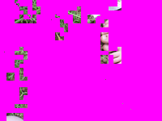 | 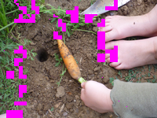 | 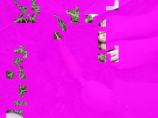 | 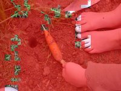 |
| rock rock-p | 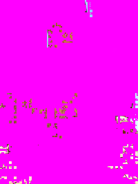 | 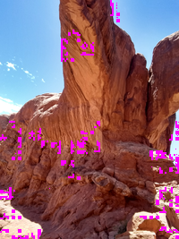 | 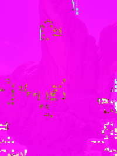 | 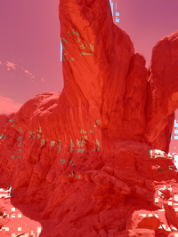 |
| scorpius scorpius-p | 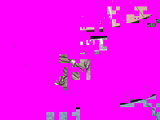 | 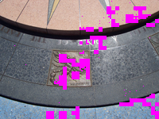 |  | 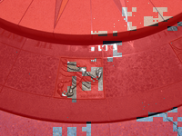 |
| shack shack-p | 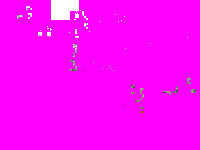 | 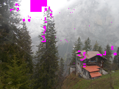 | 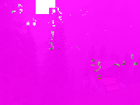 | 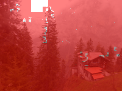 |
