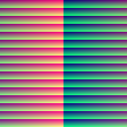
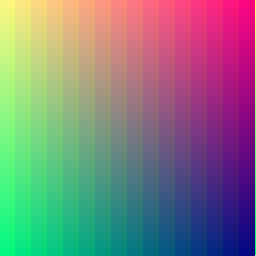
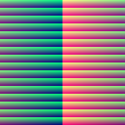
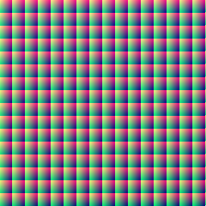
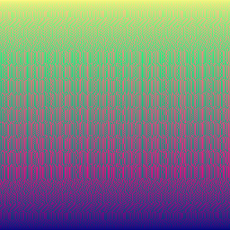

# AllColors #

| Example | Image |
|---------|-------|
| Default |  |
| -s RGB -so 1,2,3 |  |
| -s RGB -so 3,2,1 |  |
| -s RGB -so 2,3,1 |  |
| -s YCbCr -so 1,2,3 |  |
| -s YCbCr -so 3,1,2 |  |
