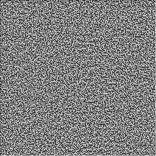
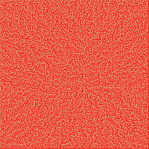
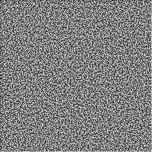
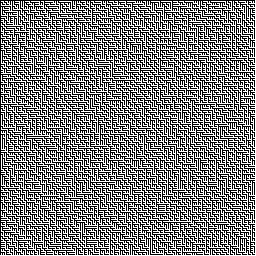
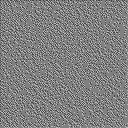
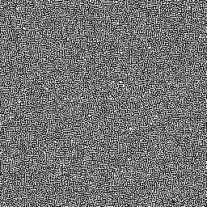
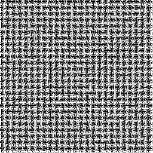
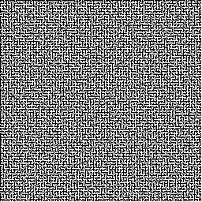
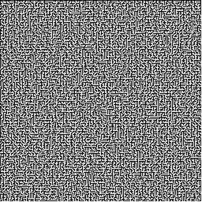
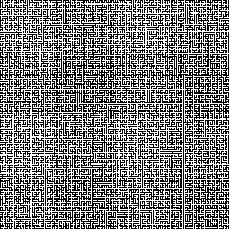

# Maze #

| Example | Image |
|---------|-------|
| 1 -rs 5003 |  |
| 2 -rs 5009 -cc tan -wc red |  |
| 3 -rs 5011 |  |
| 4 -rs 5021 |  |
| 5 -rs 5023 |  |
| 6 -rs 5039 |  |
| 7 -rs 5051 |  |
| 8 -rs 5059 |  |
| 9 -rs 5077 |  |
| 10 -rs 5081 |  |
