# ProbableImg #

| Image | -rs 321 | -rs 321 -n 5 | -rs 321 -pp 50% 50% |
|-------|---------|--------------|---------------------|
| boy | 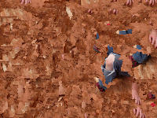 | 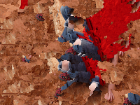 | 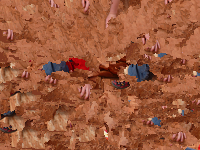 |
| cats |  | 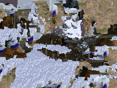 | 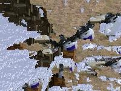 |
| cookie | 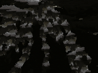 |  | 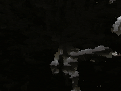 |
| flower | 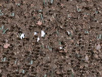 | 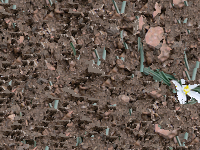 |  |
| harddrive | 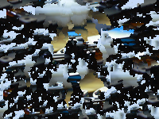 | 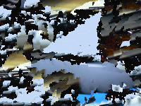 | 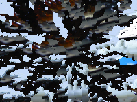 |
| shack | 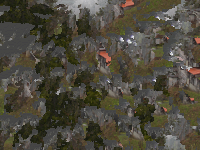 | 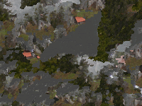 | 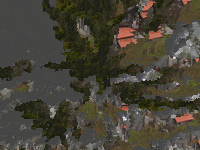 |
