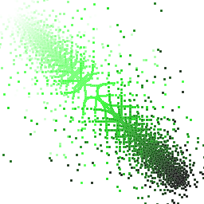
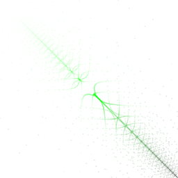
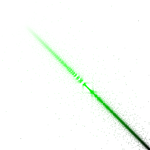
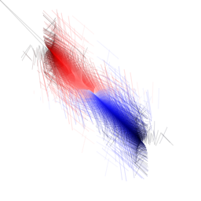
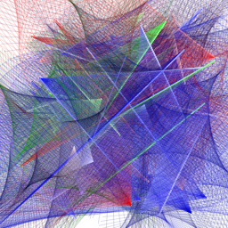

# SpearGraphic #

| Example | Image |
|---------|-------|
| -g First_Twist1 |  |
| -g First_Twist2 |  |
| -g First_Twist3 |  |
| -g Second_Twist3a |  |
| -g Second_Twist3b |  |
| -g Second_Twist3c |  |
| -g Second_Twist4 |  |
| -g Third -rs 531 |  |
| -g Fourth -rs 531 |  |
