# Examples #

Examples are categorized by Action

PixelateDetails

| Image  | Default | -p | -s 3 | -r 3 |
|--------|---------|----|------|------|
|boy     |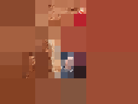|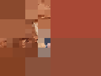|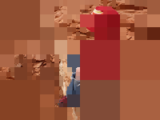||
|building|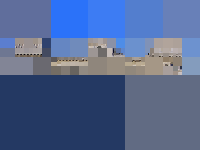|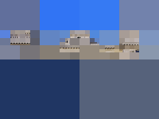|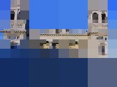|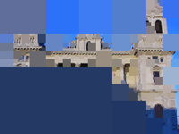|
|cats    |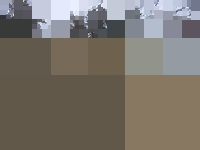|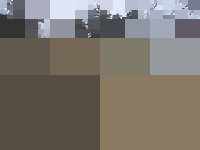|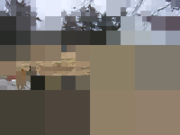|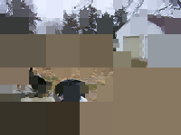|
|cloud   |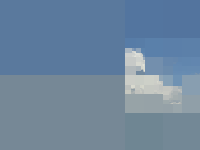|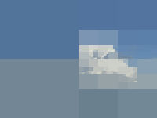|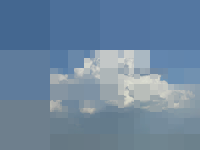|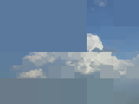|
|cookie  |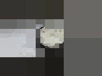|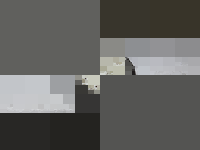|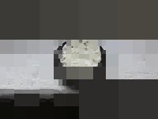|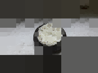|
|creek   |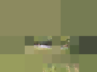|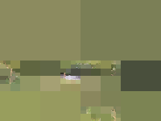|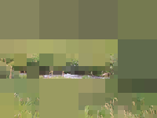|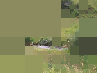|
|flower  |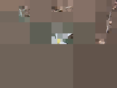|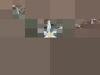|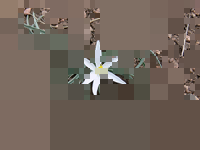|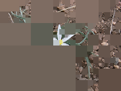|

Derivatives

| Image   | Default | -g | -a |
|---------|---------|----|----|
|fractal  |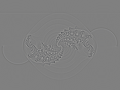|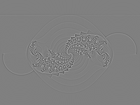|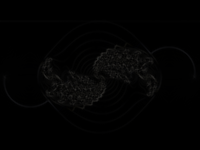|
|handle   |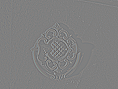|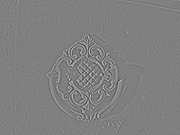|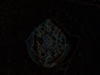|
|harddrive|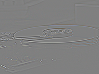|||
|lego     |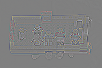|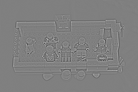|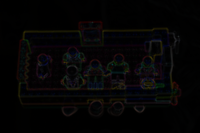|
|pool     |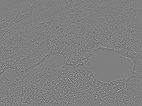|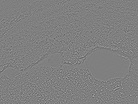|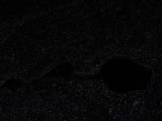|
|rainbow  |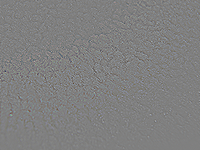|||
|road     |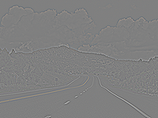|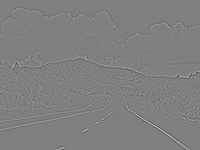|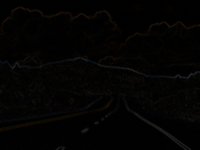|

AreaSmoother

| Image    | Default | -t 2 | -t 10 | --metric 1 | --sampler 11 |
|----------|---------|------|-------|------------|--------------|
|rock-p    |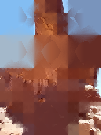|||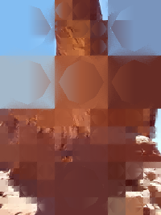|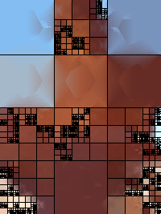|
|scorpius-p|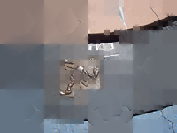|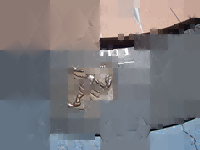||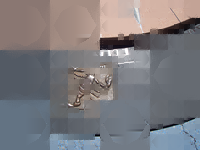||
|shack-p   ||||||
|shell-p   ||||||
|skull-p   ||||||
|spider-p  ||||||
|toes-p    ||||||

AreaSmoother2

| Image    | Default | -H | -V |
|----------|---------|----|----|
|rock-p    ||||
|scorpius-p||||
|shack-p   ||||
|shell-p   ||||
|skull-p   ||||
|spider-p  ||||
|toes-p    ||||

ZoomBlur

| Image  | Default | -z 3 |
|--------|---------|------|
|zebra   |||
|boy     |||
|building|||
|cats    |||
|cloud   |||
|cookie  |||
|creek   |||

Swirl

| Image   | Default | -rp 50% | -s 2 | -ccw |
|---------|---------|---------|------|------|
|flower   |||||
|fractal  |||||
|handle   |||||
|harddrive|||||
|lego     |||||
|pool     |||||
|rainbow  |||||

Deform

| Image  | Default | -e 2.5 | -m 2 |
|--------|---------|--------|------|
|road    ||||
|rock    ||||
|scorpius||||
|shack   ||||
|shell   ||||
|skull   ||||
|spider  ||||

Encrypt

| Image | -p 1234 |
|-------|---------|
|toes   ||
|zebra  ||

PixelRules

| Image  | Default | -m 2 | -m 3 | -n 10 |
|--------|---------|------|------|-------|
|boy     |||||
|building|||||
|cats    |||||
|cloud   |||||
|cookie  |||||
|creek   |||||
|flower  |||||

ImgDiff

| Image    | Default | -i | -o 1.0 | -o 0.5 -c red |
|----------|---------|----|--------|---------------|
|toes toes-p      |||||
|rock rock-p      |||||
|scorpius scorpius-p  |||||
|shack shack-p     |||||

